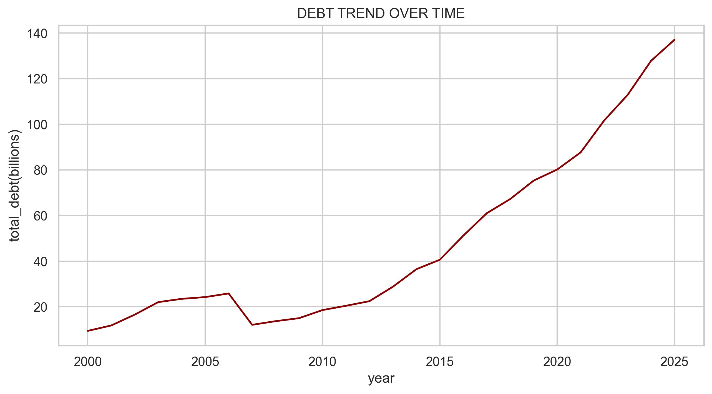
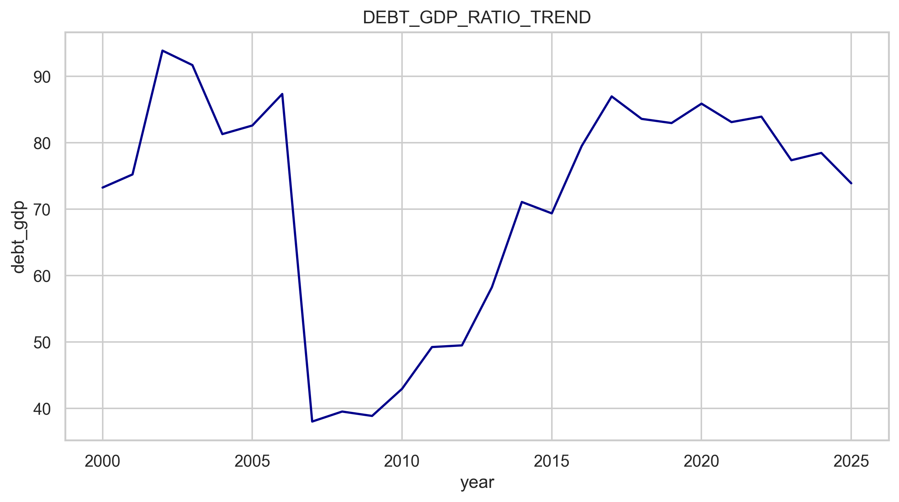
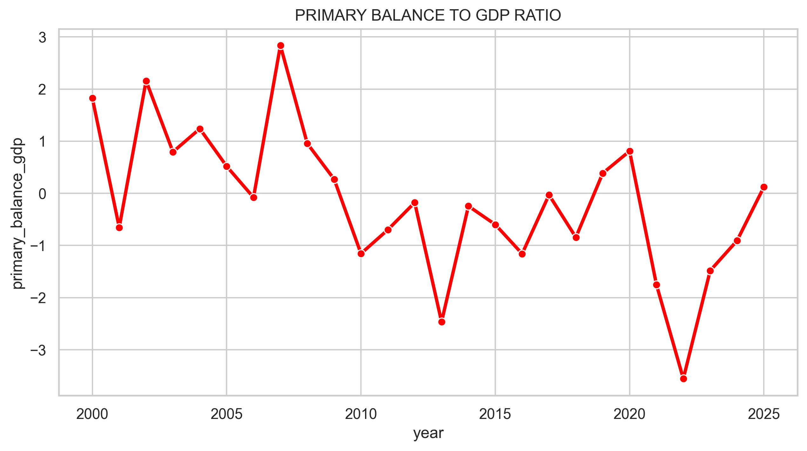
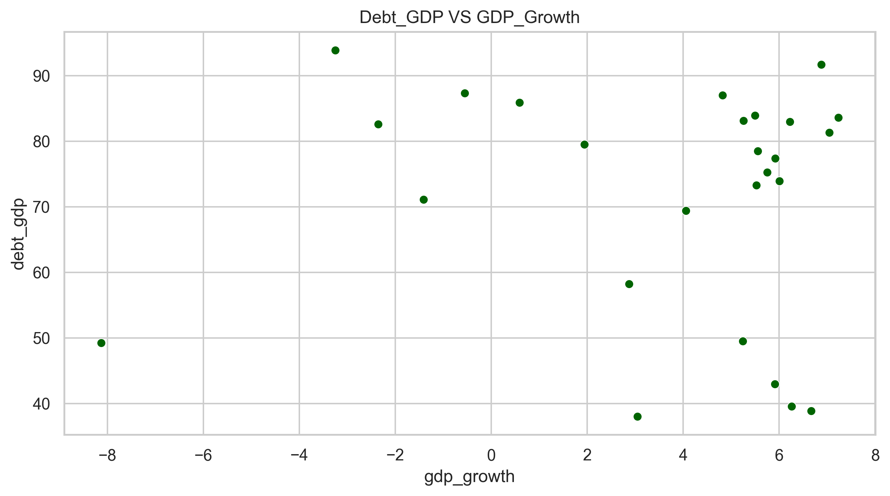
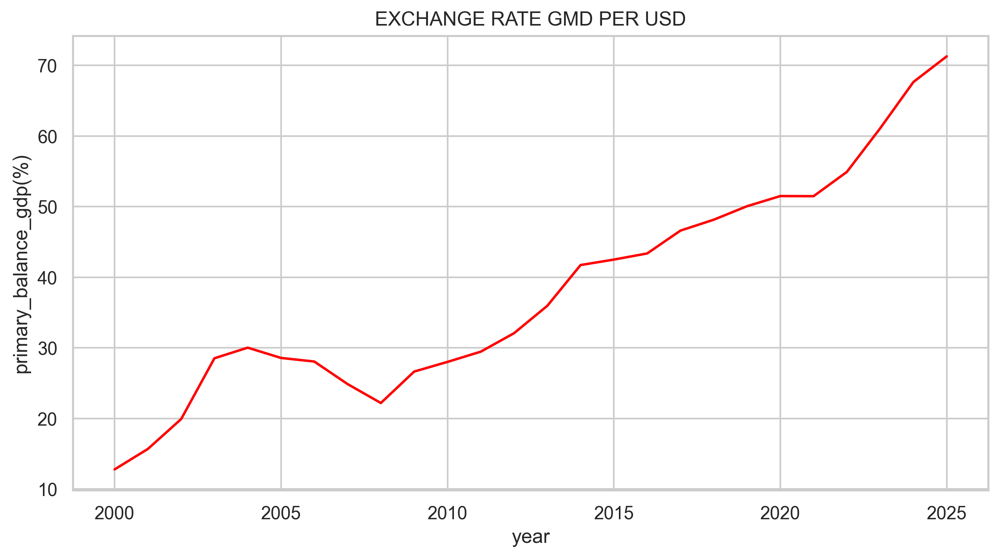

# PUBLIC-DEBT-DYNAMICS-AND-ANALYSIS-THE-GAMBIA.
Public Debt Dynamics in The Gambia (2000–2025)

Overview

This project analyzes the evolution of public debt and selected fiscal and macroeconomic indicators in The Gambia between 2000 and 2025.

The project combines Python for data preparation and visualization with Stata for time-series econometric analysis.

Objectives

* Examine trends in public debt and the debt-to-GDP ratio.
* Explore relationships between debt dynamics and key macroeconomic indicators.
* Estimate a time-series regression of changes in the debt-to-GDP ratio.
* Conduct standard econometric diagnostic tests.

Data

Annual data for 2000–2025 were obtained primarily from the IMF World Economic Outlook, with supplementary public external debt information from the World Bank.

Key variables include:

* Debt-to-GDP ratio
* Primary balance
* Fiscal balance
* Government revenue
* Government expenditure
* GDP growth
* Inflation
* Exchange rate
* Current account balance

Methodology

Python

Python was used for:

* Data extraction and cleaning
* Variable transformation
* Exploratory data analysis
* Economic visualizations
* Correlation analysis

Stata

The main regression estimates the association between changes in the debt-to-GDP ratio and:

* Primary balance
* GDP growth
* Change in inflation
* Change in government expenditure
* Change in government revenue
* Change in exchange rate

Heteroskedasticity-robust standard errors were used.

Regression Results

Observations: 25
R-squared: 0.4995
Overall F-test p-value: 0.3973

GDP growth had a coefficient of −1.3666 with a p-value of 0.054, indicating a negative association that is statistically significant at the 10% level but not at the 5% level.

The other explanatory variables were not statistically significant at conventional levels.

The results should be interpreted as associations rather than causal effects.

 Diagnostics
  * Variance Inflation Factor all < 5 - No serious multicolliniarity
  * Breush-Pagan Test p-value = 0.0004 - Hetroskedasticity Present
  * Breush-Godfrey Test p-value = 0.8616 - No evidence of Multi Autocorrelations
  * Ramsey  RESET Test p-value = 0.001 - possible model misspecification

Robust standard errors were therefore used to address heteroskedasticity.

Key Takeaway

The analysis provides some evidence of a negative association between economic growth and changes in the debt-to-GDP ratio. However, the overall regression is not jointly statistically significant, and the small annual sample and RESET result require cautious interpretation.

Limitations

* Small annual sample.
* Results are associative rather than causal.
* Possible model specification issues.
* The project does not produce long-term debt sustainability projections.

VISUALIZATIONS

   
